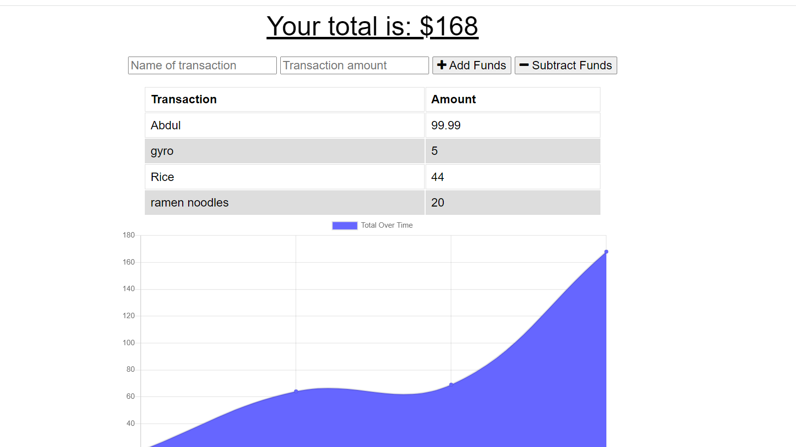

# PWA-18 Budget Tracker 
# Live Site
https://github.com/mibrahim234/PWA-budget-tracker
## Description 
Budget Tracker is a progressive web app that allows users to keep track of their income and expenses.
## Table of Contents
* [Installation](#installation)
* [Usage](#usage)
* [Start-Server](#start-server)
* [Technologies](#technologies)
* [License](#license)
* [Credits](#credits)
* [Questions](#questions)
* [Website](#website)
* [Contribution](#contribution)


## Installation
- Clone repo
- Open integrated terminal on the root directory
- Install dependencies :

```
npm i
```

---

## Usage 


- User is able to add to the budget by addition or subtraction.
- If the user updates the budget while without an internet connection, the updates will go to indexDB.
- Once the user establishes a valid internet connection, the `bulk` endpoint will be fetched to bring the database up to date.

---
### Start Server

```
npm start
```

for `nodemon server.js`:

```
npm run watch
```

---

## Technologies

- [Mongo](https://www.mongodb.com/)
- [Mongoose](https://mongoosejs.com/docs/)
- [Morgan](https://www.npmjs.com/package/morgan)
- [Express](https://www.npmjs.com/package/express-session)
- [Compression](https://www.npmjs.com/package/compression)


## License
Copyright (c) [2021]
The license is MIT License. 
Read more about it at https://opensource.org/licenses/MIT.
## Credits
Class Activities

## Questions
If you have any additional questions or would like to report an issue, please contact me at mohamm1417@gmail.com

## Website
Link to the GIT repository: <br>
https://github.com/mibrahim234/PWA-budget-tracker

Link to the Live Page: 
https://mibrahim234.github.io/PWA-budget-tracker/

## Contribution
Made with ❤️ by Mohammad Ibrahim